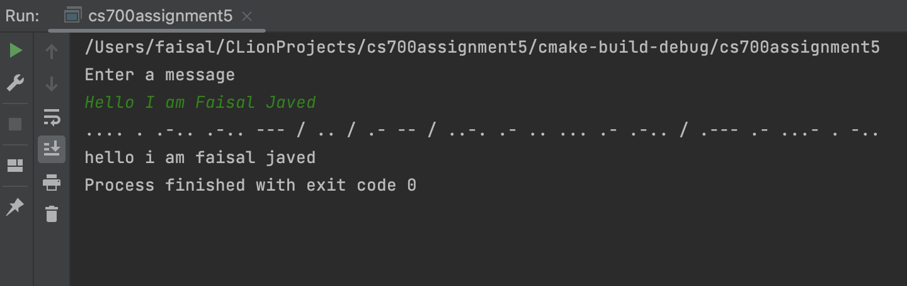

# Cs-700 Assignment 5

## Getting Started
#### This assignment contains a program take a user input and then a program will run to read a file and create a binary tree which stores alphabets in the nodes in a specific order. Then we map the alphabets with their respective morse code and store it a map. Then the user input is encoded into morse code and then decoded into message again.

### 1. Main file.
### Contents -
> i. [Main CPP File](main.cpp)
### Usage - 
#### Running the main() function will run the program and ask for user input which will then be encoded to morse code and decoded back to message.
### 2. Morse Code Encoder/Decoder -
#### Contents - 
> i. [MorseCode CPP](MorseCode.cpp) - contains all the implementations of member functions of the class MorseCode. 
> ii. [MorseCode H](MorseCode.h) - contains functions prototypes of class MorseCode 
> iii. [Binary Tree H](Binary_Tree.h) - contains functions for a Binary tree 
> iv. [BTNode H](BTNode.h) - contains functions for a binary tree node 
### Usage - 
#### Running this program will read a file then create a binary tree and then encode the user message to morse code and then decode the morse code into message.
### Output - 
1. Console output
      
